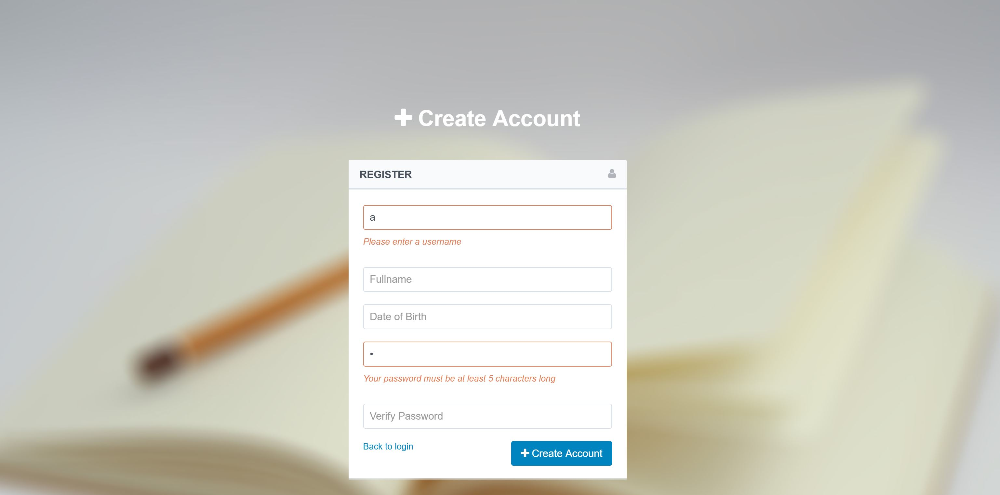
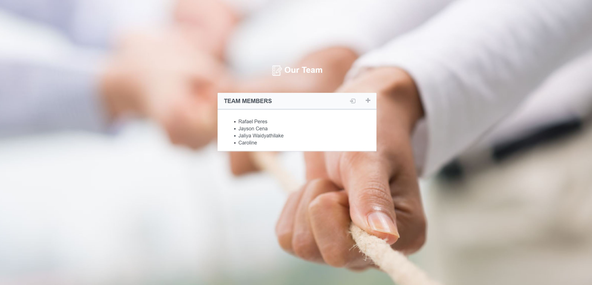
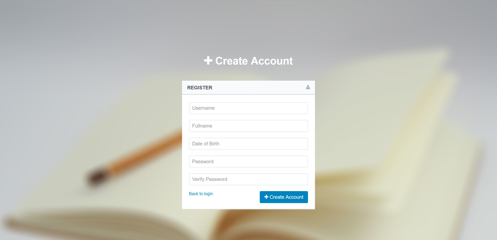
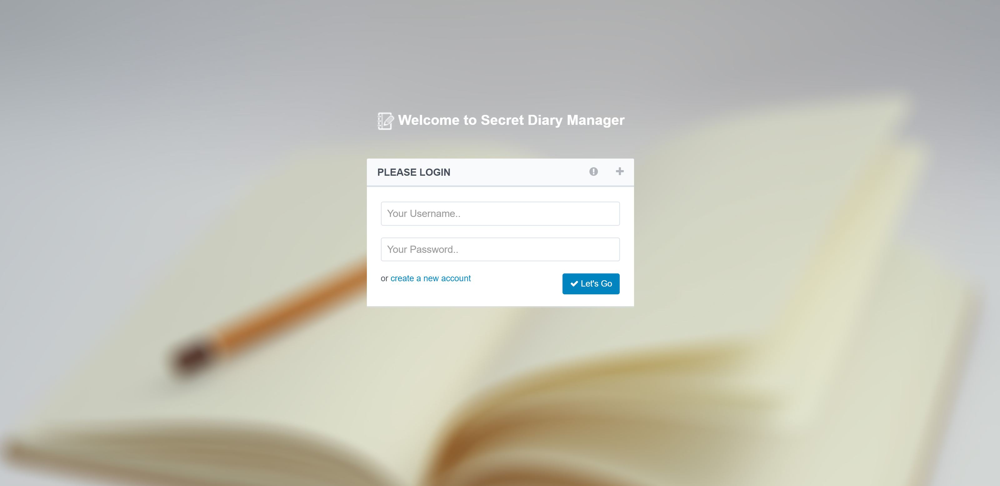
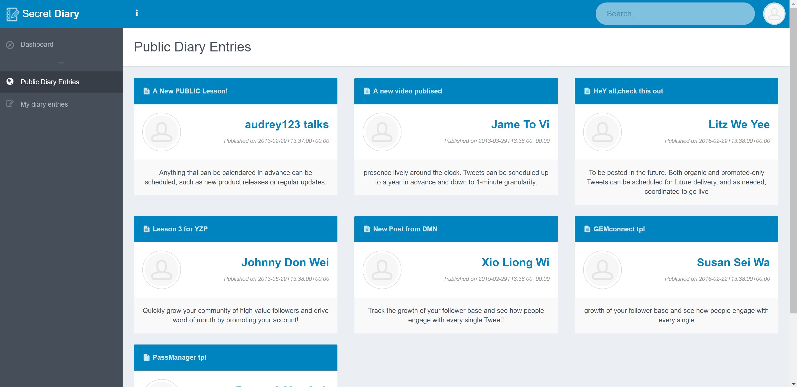
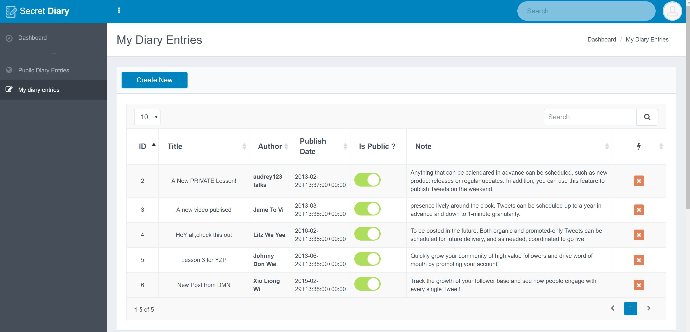
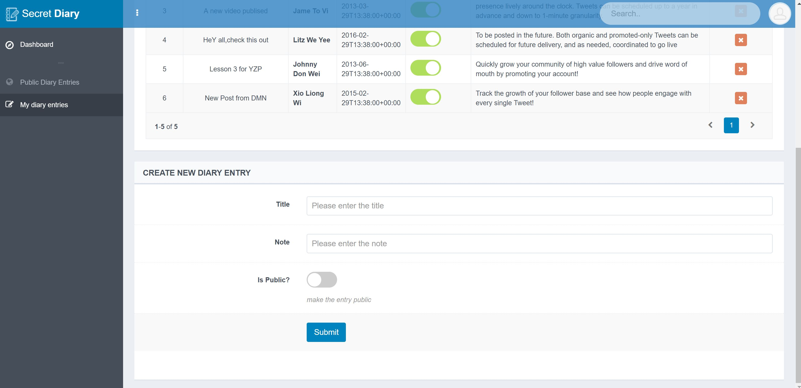

# rest-api-development

CS5331 Assignment 1 Project Reference Repository
## Instructions

Your objective is to implement a web application that provides the endpoints
specified here: https://cs5331-assignments.github.io/rest-api-development/.

The project has been packaged in an easy to set-up docker container with the
skeleton code implemented in Python Flask. You are not restricted in terms of
which language, web stack, or database you desire to use. However, please note
that very limited support can be given to those who decide to veer off the
beaten path.

You may be required to modify the following files/directories:

- Dockerfile - contains the environment setup scripts to ensure a homogenous
  development environment
- src/ - contains the front-end code in `html` and the skeleton Flask API code
  in `service`
- img/ - contains images used for this README

Assuming you're developing on an Ubuntu 16.04 machine, the quick instructions
to get up and running are:

```
# Install Docker

sudo apt-get update
sudo apt-get install \
    apt-transport-https \
    ca-certificates \
    curl \
    software-properties-common
curl -fsSL https://download.docker.com/linux/ubuntu/gpg | sudo apt-key add -
sudo add-apt-repository \
   "deb [arch=amd64] https://download.docker.com/linux/ubuntu \
   $(lsb_release -cs) \
   stable"
sudo apt-get update
sudo apt-get install docker-ce

# Verify Docker Works

sudo docker run hello-world

# Run the skeleton implementation

sudo ./run.sh
```

(Docker CE installation instructions are from this
[link](https://docs.docker.com/install/linux/docker-ce/ubuntu/#install-using-the-repository).)


## Grading

The implementation will be graded in an automated fashion on an Ubuntu 16.04
virtual machine by building the docker container found in your repository and
running it. The grading script will interact with your API.

The following ports are expected to be accessible:

1. 80, on which static HTML content, including the front-end, is served.
2. 8080, on which the API is exposed.

To verify this, please run the following commands:

```
sudo ./run.sh
```

On a different window:

```
curl http://localhost:80
curl http://localhost:8080
```

If a response is received, you're good to go.


## Screenshots
### UI Input Validation


### Members Page


### Register Page


### Login Page


### Home Page


### Private Diaries Page


### Create/Update Diary Page


## Administration and Evaluation
### Team Members

1. Caroline Astolfi
2. Jaliya Chathuranga Waidyathilake
3. Jayson Lomtong Cena
4. Rafael Peres Da Silva

### Short Answer Questions

#### Question 1: Briefly describe the web technology stack used in your implementation.

##### Backend
- Docker with runit init daemon inside to manage services
- Nginx with modsecurity for web proxy which proxies port 80(static) and 8080(API)
- Python with Flask for web framework and SQLAlchemy for ORM
- Database is sqlite and modeled in python

##### Frontend
- HTML/CSS3
- Bootstrap
- Jquery
- Ajax
- Window sessionStorage is used for token storage


#### Question 2: Are there any security considerations your team thought about?

- Window sessionStorage is used to store the token once user is logged-in. Access to the token value is restricted to the same scheme + hostname + port.
- Token is cleared when the browser closes or user logs-out
- To restrict XSS attacks in client side
  - JSON.stringify() is used for the JS object serialization(encode data) 
  - JSON.parse() is used for the deserialization 
- Only external Javascripts are used as opposed to inline or scripts on the same page
- To restrict SQL injection attacks, all queries are executed using SQLAlchemy ORM, which by default quotes special characters – semicolons or apostrophes and more advanced restrictions.
- Serve API on the same port(tcp/80 in this case) as the static files to simplify CORS configs
  - This was currently disabled to prevent automated grading script from failing
- Use JWT (JSON Web Tokens) to store user-critical states(i.e. session) on the client side
- Password hash + salt stored on the database complying with NIST guideline
- Username/Password complexity requirements (minimum-length: 5 characters)
  - Add more strict password requirements (alphanumeric, special chars, minimum 8 chararcters) in the future

#### Question 3: Are there any improvements you would make to the API specification to improve the security of the web application?

- Use JWT for session handling
- Associate IP with token (probably too strict specially with eyeballs who are getting dynamic IPs from ISPs)
- Limit the size of fields i.e. diary content
- Limit the size of request payload
- Do not pass technical details on the response (e.g. stack traces)
- X-Content-Type-Options: nosniff
- Input validation on the server-side specially on diary content. This can be viewed publicly and can do XSS on viewers

#### Question 4: Are there any additional features you would like to highlight?

- Make it more REST-ful (and easier to debug on the webserver’s access/error logs)
  - Response codes: 5xx response code for errors, 403 for auth failures
  - PUT for new diary entries, POST/UPDATE for updates, DELETE for deletes
  - /diary/<id> for accessing diaries (update/delete/get)

#### Question 5: Is your web application vulnerable? If yes, how and why? If not, what measures did you take to secure it?

Answer: Yes web application is vulnerable.

- Dictionary/brute-force attacks can be done on auth endpoints
  - Ratelimit was in-place on the API but it was temporarily disabled to prevent automated grading script from getting rate-limited
- client server communication is taken place over HTTP. So it is vulnerable to attacks associated with insecure HTTP.
- Connection can be hijacked since token is visible during the HTTP communication 
- XSS attacks due to resource (images, js etc.) downloads over HTTP
- Window.sessionStorage is used over cookies, however it is still vulnerable to XSS
- Client side Ajax requests and responses are sanitized/encoded/escaped. However still vulnerable to other types of XSS.


#### Feedback: Is there any other feedback you would like to give?

- it's fun

### Declaration

#### Please declare your individual contributions to the assignment:


1. Caroline Astolfi
  - Designed the database schema and created the database files
2. Jaliya Chathuranga Waidyathilake
  - Ui design, front end scripts. Ajax request/response
  - Integration and testing
3. Jayson Lomtong Cena
  - Updated docker env to nginx and runit and other docker env fixes
  - Authentication endpoint
  - Test script for validating compliance with API specification
4. Rafael Peres Da Silva
  - Initial User endpoint
 - Diary endpoint